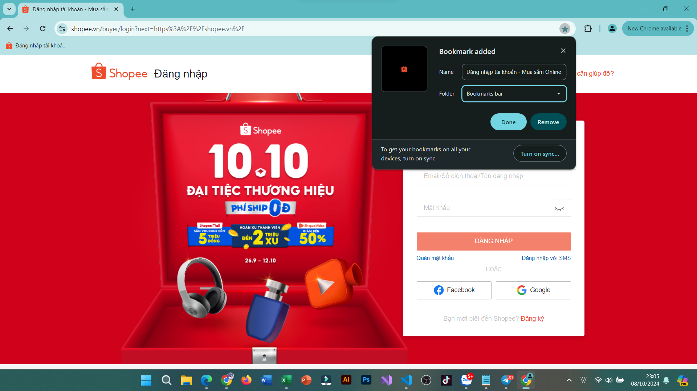
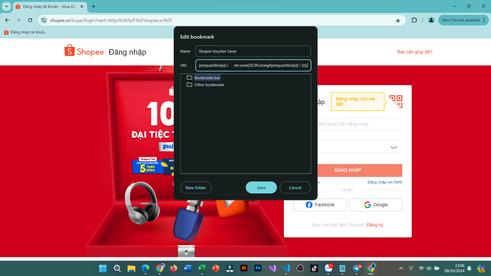
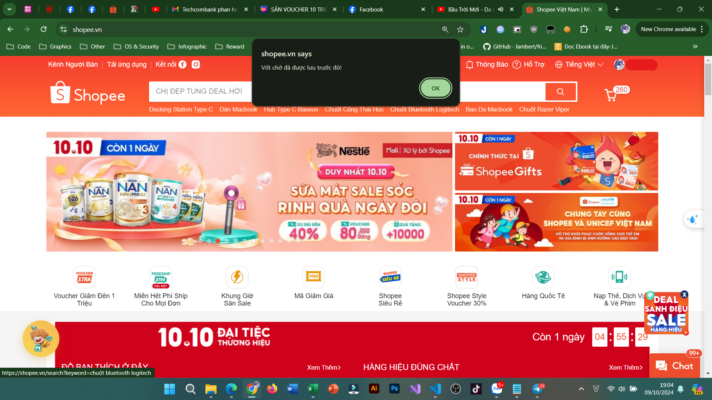

# Bookmarklet lưu voucher Shopee vào tài khoản bằng link voucher

## Hướng dẫn tạo bookmarklet

Bước 1: Tạo 1 bookmark bất kỳ, ở đây mình tạo bookmark trang Shopee

Bước 2: Sửa bookmark vừa tạo. Name đặt tuỳ ý bạn, phần URL thì paste nội dung trong file shopeeVoucherSaver.js vào và nhấn Lưu

Vậy là xong rồi!

## Sử dụng bookmarklet

Nhấn vào bookmarklet bạn đã tạo, paste link voucher bạn có vào và nhấn Enter, vậy là xong!

Lưu ý: Không phải tất cả voucher trên Shopee đều có thể lưu được bằng cách này. Một số voucher có thể lưu được bằng cách này gồm: Voucher thăng hạng kim cương (Giảm 30% tối đa 50k), Voucher nhận được khi lướt Shopee Video đủ thời gian và mở rương may mắn nhận được (hiện tại voucher này đã bị siết)
